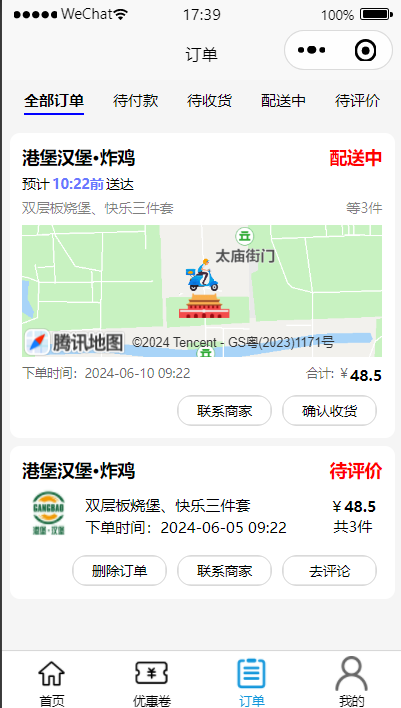

## 小新外卖【基于uniapp开发的微信小程序-前端】

### 项目介绍

小新外卖是基于uniapp开发的微信小程序，搭建一个校园外卖平台，实现学生在宿舍，教学楼可自由点餐送达，项目开源，代码可见，项目用于学习交流，很多地方都不是很规范有待改善

项目中未构建后端，数据存放于pinia中，图片存放于statis中，真实场景要搭建后端服务器，将数据文件存放到服务器中

项目未搭建后端服务器，所以评论无上传图片功能

项目很多不足之处，还请原谅！！

### 源码下载

```
https://gitee.com/piecemeals/xiaoxin-takeout.git
```

温馨提示：项目由于没有后端服务器，将店铺的图片存到了static中，导致项目打包成微信小程序后项目过大，无法预览编译，可以将一些图片先删除后可预览编译，但会数据显示不全

### 如何使用uni-app端

- 下载后解压项目，获取xiaoxin-takeout-master，再Hubilder中导入项目


- 在/pages/add-address/add-address.vue中配置腾讯地图的key，腾讯地图sdk用于配置获取用户的定位和解析经纬度


腾讯地图的sdk在腾讯位置服务中 创建应用后可获得


创建后的应用要给对应的服务分配调用额度（ip定位，逆地址解析，关键词输入）


- 在/pages/user/user.vue  中配置appId 和appSecret，用于用户登录后获得微信用户的openId（可用于用户的唯一标志，存放与数据库中） 

温馨提示：可以不进行此项配置，因为本项目未使用到openId存于数据库用于标识用户，留着用于以后要是用获得登录用户的openId 使用


appId和appSecret 在 微信公众平台中获得


- 配置好后允许到微信开发者工具


### UNIAPP-页面展示

#### 小程序首页

广告未实现点击跳转到店铺


#### 店铺分类页面


#### 店铺详情页面


#### 商品详情页面


#### 订单结算页面

未实现微信支付功能，只提供余额支付


#### 搜索页面


#### 订单页面

（未实现骑手实时定位，只是展示商家位置）




#### 个人中心页面


#### 用户收藏页面


#### 定位搜索页


